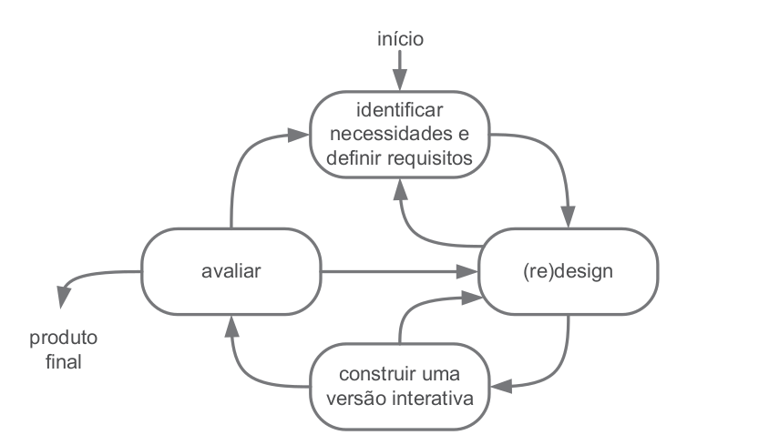

# Processo de Design

## Introdução
O projeto de design em Interação Humano-Computador (IHC) envolve três atividades principais: análise, síntese e avaliação.
 Na fase de análise, o objetivo é estudar e interpretar uma situação específica, na qual serão planejadas e executadas intervenções.
 Na etapa de síntese se concentra na implementação dessas intervenções, e a fase de avaliação verifica os efeitos gerados.
 Na intervenção, que é uma solução para um problema identificado, pode ser avaliada ao longo de todas as suas fases, desde a concepção até após sua aplicação.

Essas atividades podem ser organizadas de diversas maneiras, e os processos de design em IHC geralmente propõem uma execução iterativa para permitir uma evolução contínua das intervenções e da análise da situação.

O objetivo principal de um projeto em Interação Humano-Computador é atender às necessidades dos usuários e demais envolvidos (stakeholders). Por isso, a maioria dos processos de design é centrada no usuário e segue os princípios de foco no usuário, uso de métricas observáveis e design interativo.
## Exemplos de processos de design:

## Ciclo de vida simples

No ciclo de vida simples (Figura 1), a atividade de síntese é subdividida em design (ou redesign) e na criação de uma versão interativa. A repetição entre as atividades pode acontecer tantas vezes quanto necessário.

Figura 1: Ciclo de vida simples [Fonte](https://aprender3.unb.br/pluginfile.php/2972679/mod_resource/content/3/cap04.pdf)

## Ciclo de vida em estrela

No ciclo de vida em estrela (Figura 2), o designer pode iniciar o processo a partir de qualquer ponto. Após concluir cada atividade, é essencial realizar uma avaliação dos resultados obtidos. Nesse modelo, a atividade de síntese é dividida em etapas de projeto conceitual, especificação do design, prototipação e implementação.

Figura 2: Ciclo de vida em Estrela [Fonte](https://aprender3.unb.br/pluginfile.php/2972679/mod_resource/content/3/cap04.pdf)

## Ciclo de Vida de Nielsen

Nielsen definiu *engenharia de usabilidade* como as seguintes atividades como essenciais durante todo o ciclo de via de um produto:

> 1. Conhecer o usuário;
> 2. Realizar uma análise competitiva (examinar produtos com funcionalidades semelhantes);
> 3. Definir as metas de usabilidade;
> 4. Fazer designs paralelos (criar alternativas de design);
> 5. Adotar o design participativo (acesso da equipe à usuários representativos do público alvo);
> 6. Fazer o design coordenado da interface como um todo (design de todos os elementos da interface, como documentação, sistema de ajuda e etc);
> 7. Aplicar diretrizes e análise heurística;
> 8. Fazer protótipos;
> 9. Realizar testes empíricos;
> 10. Praticar design iterativo (correção de problemas durante as iterações de design e avaliação);

## Ciclo de vida da Mayhew

Nesse ciclo de vida as atividades são divididas em três fases: análise de requisitos, design/avaliação/desenvolvimento e instalação, representados em detalhes na Figura 3. A primeira fase consiste na definição das metas de usabilidade, com base em dados coletados por meio de atividades como a análise do perfil do usuário e das tarefas. Durante a segunda fase o designer elabora uma solução de IHC atendendo as metas de usabilidade definidas na primeira fase. Por fim, na etapa de instalação, o projetista coleta opiniões dos usuários após o uso do sistema e utiliza tais opiniões na elaboração de melhorias.

Figura 3: Ciclo de vida Mayhew [Fonte](https://aprender3.unb.br/pluginfile.php/2972679/mod_resource/content/3/cap04.pdf)

## Motivações para a escolha

  Após analisar os modelos apresentados e considerando as entregas da disciplina, o grupo avaliou as vantagens e desvantagens de cada um para escolher o processo mais adequado ao projeto. Chegou-se ao consenso de que o Ciclo de Vida de Mayhew seria a melhor opção, principalmente por suas etapas serem bem definidas e detalhadas, o que reduz a subjetividade, diferentemente do ciclo de vida simples. Considerando a pouca experiência do grupo na área de IHC, um modelo mais completo e estruturado se mostra mais adequado, funcionando como um guia no desenvolvimento do projeto.

## Bibliografia

> \- Processos de Design de IHC Capítulo 6, Interação Humano-Computador e Experiência do Usuário, Simone Barbosa e Bruno Santana

> \-https://moodle.ead.unipar.br/materiais/webflow/design-de-interface-humano-computador/unidade-ii.html

> \-https://docente.ifrn.edu.br/joaoqueiroz/disciplinas/ihc-interacao-humano-computador/aulas/aula-5

|Data|Data Prevista de Revisão|Versão|Descrição|Autor|Revisor|
| :----------: |:-----------:| :------: | :-----------: | :---------: |:---------: |
|11/11/2024|11/11/2024|1.0|Criação da pagina|Breno Lucena| Breno Fernandes |