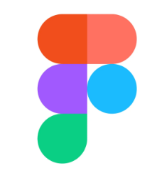
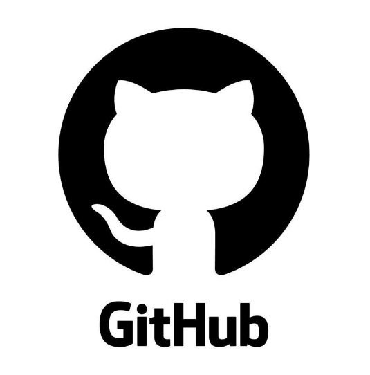
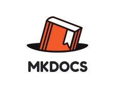
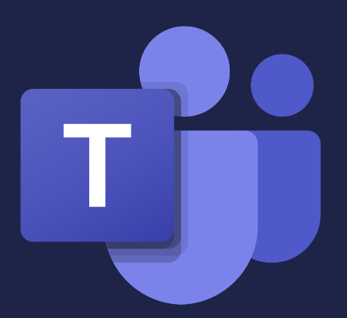
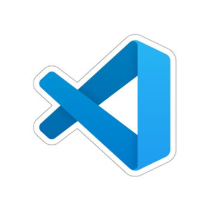
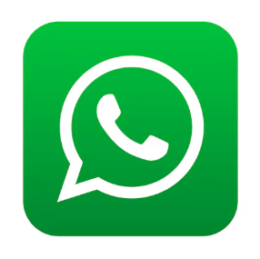
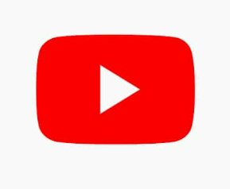

# Ferramentas

## Introdução

Para garantir o sucesso deste projeto, utilizamos diversas ferramentas computacionais que facilitam a organização e o gerenciamento da equipe, além de apoiar a produção dos artefatos. As ferramentas selecionadas foram escolhidas para otimizar o fluxo de trabalho e estão descritas na Tabela 1.

## Ferramentas Utilizadas

**Tabela 1 - Ferramentas Utilizadas no Projeto**

| Ferramenta                                         | Finalidade                                                                                                                              |
| -------------------------------------------------- | --------------------------------------------------------------------------------------------------------------------------------------- |
|             | **Figma** - Para prototipagem e criação de wireframes. Essa ferramenta ajuda a visualizar e simular melhorias na interface.1 |
|           | **GitHub** - Ferramenta para organização, versionamento e documentação dos artefatos produzidos ao longo do projeto.2        |
|  | **Google Docs** - Colaborar na criação e edição de documentos em tempo real.3                                                |
|           | **MkDocs** - Criar documentações de maneira rápida e organizada, com suporte para publicação na web.4                        |
|             | **Microsoft Teams** - Facilitar a comunicação e colaboração em tempo real entre os membros da equipe.5                       |
|          | **Visual Studio Code** - Editar e desenvolver código de forma eficiente com suporte a várias extensões.6                     |
|       | **WhatsApp** - Comunicação rápida e prática para alinhamentos e atualizações da equipe.7                                     |
|         | **YouTube** - Assistir a tutoriais e materiais complementares para aprendizado e desenvolvimento de habilidades.8            |

<em>Fonte: Autores.</em>

## Bibliografia

1. Figma. Disponível em: [https://www.figma.com/](https://www.figma.com/). Acesso em: 29 de nov. de 2024.

2. GitHub. Disponível em: [https://docs.github.com/pt](https://docs.github.com/pt). Acesso em: 29 de nov. de 2024.

3. Google Docs. Disponível em: [https://www.google.com/intl/pt-BR/docs/about/](https://www.google.com/intl/pt-BR/docs/about/). Acesso em: 29 de nov. de 2024.

4. MkDocs. Disponível em: [https://www.mkdocs.org/](https://www.mkdocs.org/). Acesso em: 29 de nov. de 2024.

5. Microsoft Teams. Disponível em: [https://www.microsoft.com/pt-br/microsoft-teams/group-chat-software](https://www.microsoft.com/pt-br/microsoft-teams/group-chat-software). Acesso em: 29 de nov. de 2024.

6. Visual Studio Code. Disponível em: [https://code.visualstudio.com/](https://code.visualstudio.com/). Acesso em: 29 de nov. de 2024.

7. WhatsApp. Disponível em: [https://www.whatsapp.com/?lang=pt_br](https://www.whatsapp.com/?lang=pt_br). Acesso em: 21 de abr. de 2023.

8. YouTube. Disponível em: [https://about.youtube/](https://about.youtube/). Acesso em: 29 de nov. de 2024..

## Histórico de Versão

|    Data    | Data Prevista de Revisão | Versão |                  Descrição                  |      Autor      |   Revisor    |
| :--------: | :----------------------: | :----: | :-----------------------------------------: | :-------------: | :----------: |
| 11/11/2024 |        11/11/2024        |  1.0   |      Criação da pagina de ferramentas       | Breno Fernandes | Mateus Viera |
| 29/11/2024 |        30/11/2024        |  1.1   | Adicionando mais ferramentas e bibliografia | Breno Fernandes | Breno Lucena |

